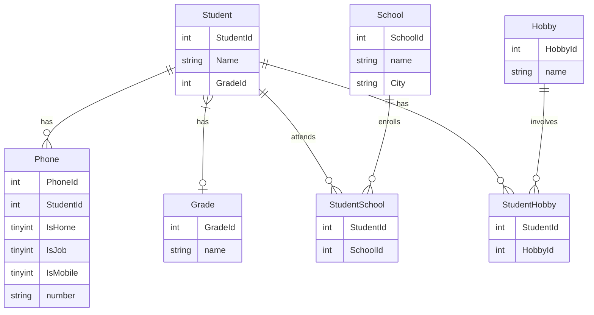

# edu-crud-jdbc

## Beskrivning

>I kursen DB2022 på IT-Högskolan skulle vi efter kursens slut redovisa våra färdigheter i SQL, Normalisering samt Java mot en relationsdatabas. Detta är min redovisning från denna kurs. Parallellt med kursen på It-högskolan läste jag även av eget fördjupningsintresse kursen “Mastering SQL (Using MySql, Java and Go) på Udemy.

### Under kursen på IT-Högskolan lärde jag mig 

>#### Databaser
> - Design av relationsdatabaser
> - SQL-syntax för att ta fram, sätta ihop och organisera bland data
> - DDL: Skapa och ändra tables
> - DML: Uppdatera och eliminera tables
> - DQL: Välja ut specifik data i en databas
        - DCL: Ändra och upphäva användares rättigheter i databasen
        - TCL: Hantera transaktioner
        - Skapa SQL scripts
        - ACID
        - Vikten av konsistens och hur man med hjälp av Normalisering (1NF - 3NF) skyddar konsistensen genom att ta bort/eliminera 
          anomalier och på så vis undvika redundant data.
####  Entity Relationship Diagram

