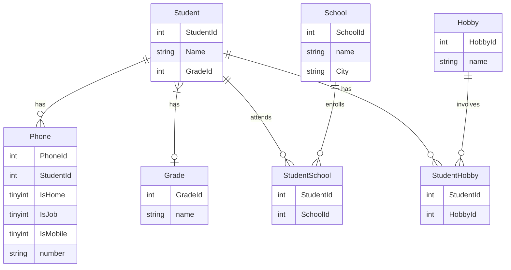

# CRUD AND NORMALIZATION

---

## Inledning

I kursen Utveckling mot databaser på IT-Högskolan skulle vi efter kursens slut redovisa våra färdigheter i SQL, Normalisering samt Java mot en relationsdatabas. Detta är min redovisning från denna kurs. Projektet består av två delar, den ena utgörs av ett normaliserings-script i SQL och det andra av en CRUD-applikation i testgrenen i Java. Vad gäller scriptet läses först en CSV fil med data in där hänsyn tas till att å, ä och ö förekommer i datan. Därefter normaliseras datan till första till tredje normalform (1NF-3NF) - och ett antal användbara tables och views skapas. Några av relationerna mellan datan synliggörs i diagrammet nedan.

---

## Verktyg som använts:

- Docker
- SQL (DDL, DML, DQL)
- Normalisering (1NF-3NF), ACID
- Mermaid 
- Markdown
- JUnit
- Vi, gradle, bash

---

### Entity Relationship Diagram


---
## Instruktioner

#### För att köra projektet i Intellij: idea.cmd . för Windows, idea. för OS.

#### Kör scriptet:
```
docker exec -i iths-mysql mysql -uiths -piths < normalization.sql 
```
#### Kör Test.Java i bash:
```
gradle check
```


<--
### Under kursen Utveckling mot databaser vid IT-Högskolan lärde jag mig på djupet om följande

#### Databaser
>Design av relationsdatabaser. SQL-syntax för att ta fram, sätta ihop och organisera bland data. 
> - **DDL**: Skapa och ändra tables 
> - **DML**: Uppdatera och eliminera tables 
> - **DQL**: Välja ut specifik data 
> - **DCL**: Ändra och upphäva användares rättigheter i databasen 
> - **TCL**: Hantera transaktioner  
>
>Skapa <mark>SQL script</mark>. ACID. Vikten av konsistens och hur man med hjälp av Normalisering (1NF-3NF)  skyddar konsistensen genom att eliminera anomalier och på så vis undvika redundant data.
#### Utveckling mot relationsdatabaser med Java
>Skapa och förstå javaapplikationer som nyttjar relationsdatabaser. 
> - Bädda in SQL i javakod och göra förfrågningar mot databas 
> - Skapa <mark>CRUD-applikationer</mark> 
> - Skapa Springbootapplikationer för att komma åt JPA 
> - Använda Jdbc Interfaces: Konstruera javakod med Driver Manager, Driver, Connection, Statement, Prepare statement och Result set 
> - JUnit: Som ett alternativt sätt att köra kod. Unit test Lifecycle. Test, BeforeEach, AfterEach, AfterAll, AfterEach
#### Mermaid och Lucidchart
>Konstruera kodnära grafer i form av Entity-Relationship Diagram som illustrerar relationer i databasen och synliggöra flöden.
#### Vi, Gradle och Bash 
>Effektivt göra små förändringar i filer via terminalen med Vi. Skapa javaprojekt med Gradle, köra och testa dessa med bashkommandon samt Dependency Management: Låna mjukvara till styrfil från gradle/maven repository. Snabbt hantera filer med Bash. 
#### Docker
>Hur man kan få tillgång till en utvecklingsmiljö utan att behöva installera en faktisk databas. 
> - Arbeta med ett Relationship Database Management system som MySQL eller en dokumentdatabas (MongoDB) och ha många databaser igång samtidigt.
> - Importera kommaseparerat data till en extern maskin och köra sql scripts i en extern maskin. 
> - Docker lifecycle: Run, create/rm, start/stop, pause/unpause-->
#### Markdown och git
>Dokumentering av projekt med ett tidsbestämt språk och version control.
