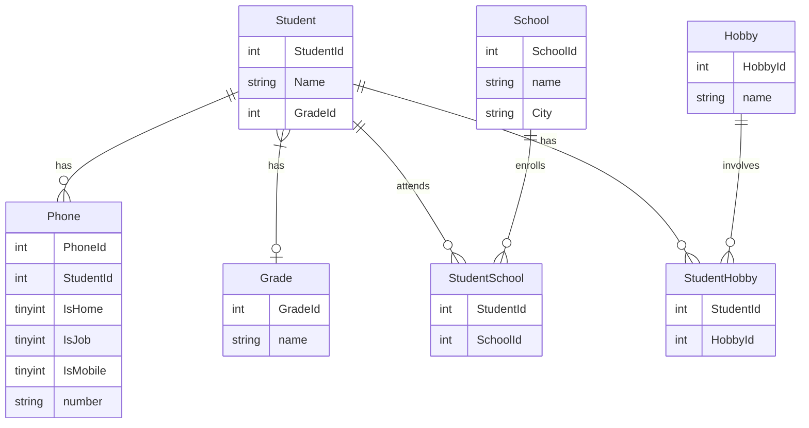

# DATABASE DESIGN, NORMALIZATION

---

## Beskrivning

I kursen Utveckling mot databaser på IT-Högskolan skulle vi efter kursens slut redovisa våra färdigheter i SQL, Normalisering samt Java mot en relationsdatabas. Detta är min redovisning från denna kurs. Projektet består av två delar, den ena utgörs av ett normaliserings-script i SQL och det andra av en CRUD-applikation i testgrenen i Java. Vad gäller scriptet läses först en CSV fil med data in där hänsyn tas till att å, ä och ö förekommer i datan. Därefter normaliseras datan till första till tredje normalform (1NF-3NF) - och ett antal användbara tables och views skapas. Några av relationerna mellan datan synliggörs i diagrammet nedan.

---

## Verktyg som använts:

- Docker
- SQL (DDL, DML, DQL)
- Normalisering (1NF-3NF), ACID
- Mermaid 
- CRUD
- Markdown
- JUnit
- Vi, gradle, bash

---

### Entity Relationship Diagram


---
## Instruktioner
Clona projektet:
```
git clone https://github.com/AnnaAxelsson051/Database-Design-Normalization.git
```
För att köra projektet i Intellij:
- Windows: 
```
idea.cmd .
```
- OS:
```
idea.
```
Kör scriptet:
```
docker exec -i iths-mysql mysql -uiths -piths < normalization.sql 
```
Kör AppTest.Java i bash:
```
gradle check
```
