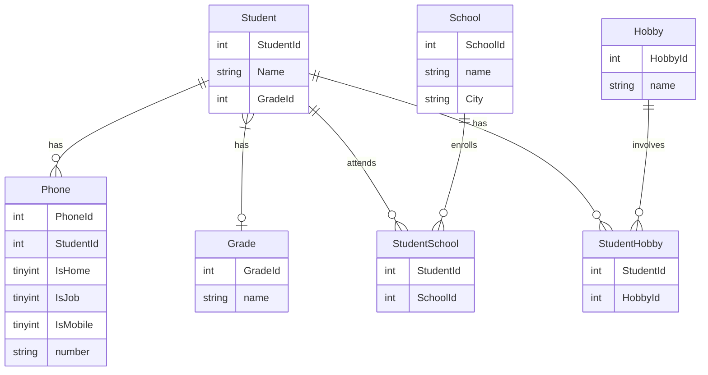

# edu-crud-jdbc

## Beskrivning

>I kursen DB2022 på IT-Högskolan skulle vi efter kursens slut redovisa våra färdigheter i SQL, Normalisering samt Java mot en relationsdatabas. Detta är min redovisning från denna kurs. Parallellt med kursen på It-högskolan läste jag även av eget fördjupningsintresse kursen “Mastering SQL (Using MySql, Java and Go) på Udemy.

### Under kursen på IT-Högskolan lärde jag mig 

>#####Databaser
>Design av relationsdatabaser. SQL-syntax för att ta fram, sätta ihop och organisera bland data. DDL: Skapa och ändra tables. DML: Uppdatera och eliminera tables. DQL: Välja ut specifik data i en databas. DCL: Ändra och upphäva användares rättigheter i databasen. TCL: Hantera transaktioner. Skapa SQL scripts. ACID. Vikten av konsistens och hur man med hjälp av Normalisering (1NF - 3NF) skyddar konsistensen genom att ta bort/eliminera 
          anomalier och på så vis undvika redundant data.
>##### Utveckling mot relationsdatabaser med Java
> - Skapa och förstå javaapplikationer som nyttjar relationsdatabaser
> - Bädda in SQL i javakod och göra förfrågningar mot databas 
> - Skapa Springbootapplikationer för att komma åt JPA
>##### Jdbc Interfaces
> - Konstruera javakod med Driver Manager, Driver, Connection, Statement, Prepare statement och Result set
>##### Mermaid
> - Rita Entity-Relationship Diagram som illustrerar relationer i databasen
>##### Vi/Vim
> - Snabbt göra små förändringar i filer via terminalen
>##### JUnit
> - Som ett alternativt sätt att köra kod. Unit test Lifecycle
> - Test, BeforeEach, AfterEach, AfterAll, AfterEach
>##### Gradle 
> - Skapa nya javaprojekt med gradle, köra och testa dessa med bashkommandon
> - Dependency Management, låna mjukvara till styrfil från gradle/maven repository för att få en driver 
>##### CRUD
> - DQL, DML
>#####. Docker
> - Hur man kan få tillgång till en utvecklingsmiljö utan att behöva installera en faktisk databas och arbeta med ett Relationship Database Management system som MySQL eller en dokumentdatabas (MongoDB) och ha många databaser igång samtidigt
> - Importera kommaseparerat data till en extern maskin och köra sql scripts i en extern maskin
> - Docker lifecycle: Run, create/rm, start/stop, pause/unpause
>##### Bash
> - Snabb hantering av filer 
>##### Markdown
> - Dokumentering av projekt med ett tidsbestämt språk 
>##### Lucidchart
> - Konstruera diagram och flödesscheman 
>##### Git
> - Version control - git lifecycle

####  Entity Relationship Diagram

