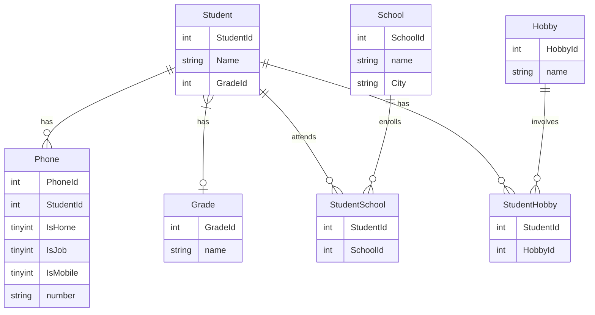

# CRUD and Normalization

## Beskrivning

>I kursen Utveckling mot databaser på IT-Högskolan skulle vi efter kursens slut redovisa våra färdigheter i SQL, Normalisering samt Java mot en relationsdatabas. Detta är min redovisning från denna kurs. Parallellt med kursen på IT-Högskolan läste jag även av eget fördjupningsintresse online-kursen *Mastering SQL (Using MySql, Java and Go)* på Udemy.

### Under kursen Utveckling mot databaser på IT-Högskolan lärde jag mig 

#### Databaser
>Design av relationsdatabaser. SQL-syntax för att ta fram, sätta ihop och organisera bland data. 
> - **DDL**: Skapa och ändra tables 
> - **DML**: Uppdatera och eliminera tables 
> - **DQL**: Välja ut specifik data 
> - **DCL**: Ändra och upphäva användares rättigheter i databasen 
> - **TCL**: Hantera transaktioner  
>Skapa <mark>SQL script</mark>. ACID. Vikten av konsistens och hur man med hjälp av Normalisering (1NF-3NF)  skyddar konsistensen genom att eliminera anomalier och på så vis undvika redundant data.
#### Utveckling mot relationsdatabaser med Java
>Skapa och förstå javaapplikationer som nyttjar relationsdatabaser. 
> - Bädda in SQL i javakod och göra förfrågningar mot databas 
> - Skapa <mark>CRUD-applikationer</mark> 
> - Skapa Springbootapplikationer för att komma åt JPA. 
> - Använda Jdbc Interfaces: Konstruera javakod med Driver Manager, Driver, Connection, Statement, Prepare statement och Result set. 
> - JUnit: Som ett alternativt sätt att köra kod. Unit test Lifecycle. Test, BeforeEach, AfterEach, AfterAll, AfterEach.
#### Mermaid och Lucidchart
>Konstruera kodnära grafer i form av Entity-Relationship Diagram som illustrerar relationer i databasen och synliggöra flöden.
#### Vi/Vim, Gradle och Bash 
>Effektivt göra små förändringar i filer via terminalen med Vi. Skapa javaprojekt med Gradle, köra och testa dessa med bashkommandon samt Dependency Management: Låna mjukvara till styrfil från gradle/maven repository. Snabbt hantera filer med Bash. 
#### Docker
>Hur man kan få tillgång till en utvecklingsmiljö utan att behöva installera en faktisk databas 
> - Arbeta med ett Relationship Database Management system som MySQL eller en dokumentdatabas (MongoDB) och ha många databaser igång samtidigt.
> - Importera kommaseparerat data till en extern maskin och köra sql scripts i en extern maskin. 
> - Docker lifecycle: Run, create/rm, start/stop, pause/unpause
#### Markdown och git
>Dokumentering av projekt med ett tidsbestämt språk och version control.
<br>

## Projektet

>Det här projektet består av två delar, den ena utgörs av en CRUD-applikation skriven i testgrenen i Java. Begreppet CRUD står för Create, Read, Update, Delete och är en livscykel för entiteter i databaser. Den andra delen av projektet består av ett normaliseringsscript skrivet i SQL. Ett script är en sekvens av instruktioner som i detta fall kommer att normalisera data från en csv fil och därigenom skapa ett antal användbara tables.

### Instruktioner för att köra Javaprojektet
```
gradle check
```
### Instruktioner för att köra scriptet
```
docker exec -i iths-mysql mysql -uiths -piths < normalisering.sql 
```
### Entity Relationship Diagram

>Följande graf synliggör några av relationerna i databasen efter det att normaliseringen slutförts


