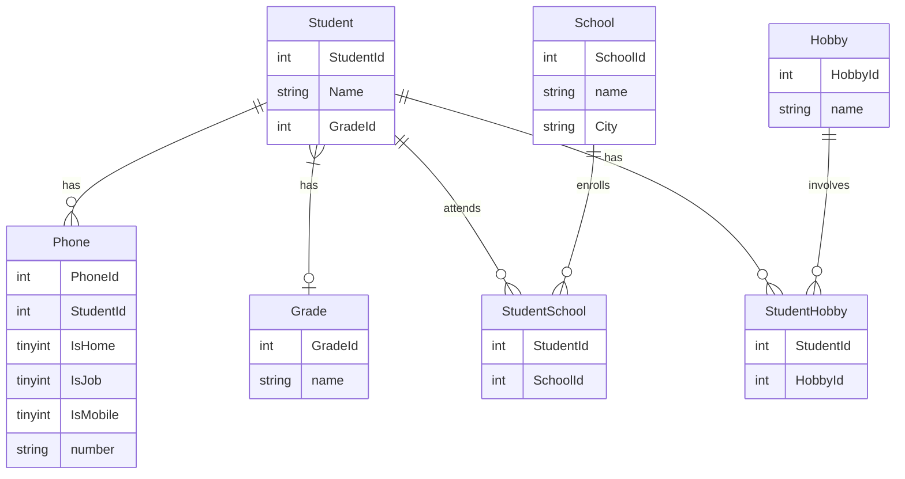

# edu-crud-jdbc

## Beskrivning

>I kursen DB2022 på IT-Högskolan skulle vi efter kursens slut redovisa våra färdigheter i SQL, Normalisering samt Java mot en relationsdatabas. Detta är min redovisning från denna kurs. Parallellt med kursen på It-högskolan läste jag även av eget fördjupningsintresse kursen “Mastering SQL (Using MySql, Java and Go) på Udemy.

### Under kursen på IT-Högskolan lärde jag mig 

####  Entity Relationship Diagram

